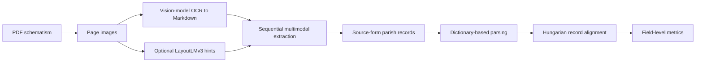

# Ecclesiastical Schematism Extraction

This repository is the versioned code artifact accompanying the article
*The Use of Advanced Digital Tools in Documentary Work on the Historical
Geography of the Church*. It preserves the implementation used to extract and
evaluate parish records from annual diocesan directories (schematisms). It is
not maintained as a general-purpose document AI framework.

The artifact is derived from the earlier
[`artpods56/Notarius`](https://github.com/artpods56/Notarius) project. Its Git
history is retained for provenance, while the supported configuration is frozen
in [`configs/article/paper-v1.yaml`](configs/article/paper-v1.yaml).

## Method represented by the code



For every page, the extraction model receives the page image, OCR or Markdown
text for the current page, optional LayoutLMv3 hints, the structured context
returned for the preceding page, and OCR text from the following page. The
default sliding window keeps five recent exchanges; images and duplicated
next-page OCR are removed from retained history. The model returns source-form
values and a `PageContext` carrying the active deanery to the next page.

The paper configuration records:

- dataset: `artpods56/KUL_IDUB_EcclessiaSchematisms`;
- corpus: the 42 diocesan schematisms listed in the article appendix;
- model endpoint: OpenRouter;
- model identifier: `google/gemini-3-flash-preview`;
- temperature: `0.1`;
- structured-extraction prompt version: `0.0.3`;
- LayoutLMv3 hints: supported, but disabled for the reported corpus evaluation;
- alignment: Hungarian algorithm with the field weights recorded in the config.

The model identifier is intentionally pinned even though a preview endpoint may
eventually be withdrawn. Replacing it enables a new experiment, but no longer
reproduces the paper artifact.

## Repository map

- `configs/article/paper-v1.yaml`: authoritative experiment contract.
- `docs/ARTICLE_METHOD.md`: article-to-code concordance and artifact boundary.
- `src/notarius/article/`: validation and artifact-integrity checks.
- `src/notarius/infrastructure/llm/prompts/tasks/`: frozen Jinja2 prompts.
- `src/notarius/application/services/context/`: sequential context strategies.
- `src/notarius/orchestration/`: Dagster extraction and evaluation pipeline.
- `data/mappings/`: source-to-database normalization dictionaries.
- `scripts/dagster/run_evaluation_jobs.py`: exact 42-schematism evaluation submission.
- `examples/wloclawek_1872/`: running example used in the article.

## Installation

Prerequisites are Python 3.12.9, [`uv`](https://docs.astral.sh/uv/), Tesseract,
and an OpenRouter API key. CUDA is needed only when optional LayoutLMv3 inference
is enabled.

```bash
uv sync --frozen
cp .env.example .env
uv run schematism-artifact verify
```

Set at least these values in `.env` before a live run:

```dotenv
STORAGE_ROOT=./tmp
LOGS_DIR=./tmp/logs
OPENROUTER_API_KEY=replace-me
HF_TOKEN=replace-me-if-the-dataset-requires-authentication
```

The verification command validates the typed paper configuration, exact corpus
membership, runtime model settings, prompt versions, and SHA-256 hashes. It does
not call an external model.

## Reproducing the evaluation workflow

Start Dagster in one terminal:

```bash
uv run dagster dev
```

Submit the frozen article run in another terminal:

```bash
uv run python scripts/dagster/run_evaluation_jobs.py
```

The pipeline downloads the configured Hugging Face split, creates vision-model
OCR, performs page-sequential source extraction, parses values with the mapping
dictionaries, aligns predictions to reference records, and exports source-form
and parsed evaluation tables. API responses are cached under `STORAGE_ROOT`.
Because remote generative APIs are nondeterministic and model endpoints change,
the archived evaluation outputs in the article's research-data package remain
the authoritative reported results.

## Running the checks

```bash
uv run pytest tests/article
uv run pytest
```

The focused artifact tests are suitable for checking a citation release. The
full suite additionally covers the inherited pipeline implementation.

## Data and licensing

Source scans, complete reference data, and full model outputs are archived in
the [Zenodo research-data record](https://doi.org/10.5281/zenodo.21302224),
version 1.0.0. The record metadata are public and the deposited files currently
have restricted access. This repository contains only the small Włocławek 1872
running example and normalization dictionaries needed to explain the workflow.

Code is released under the [MIT License](LICENSE). Historical scans and research
data retain the licenses stated in their respective data records.

## Citation

Use the metadata in [`CITATION.cff`](CITATION.cff) and cite the exact Git tag or
commit used. The accompanying research-data package is available at
[doi:10.5281/zenodo.21302224](https://doi.org/10.5281/zenodo.21302224).
